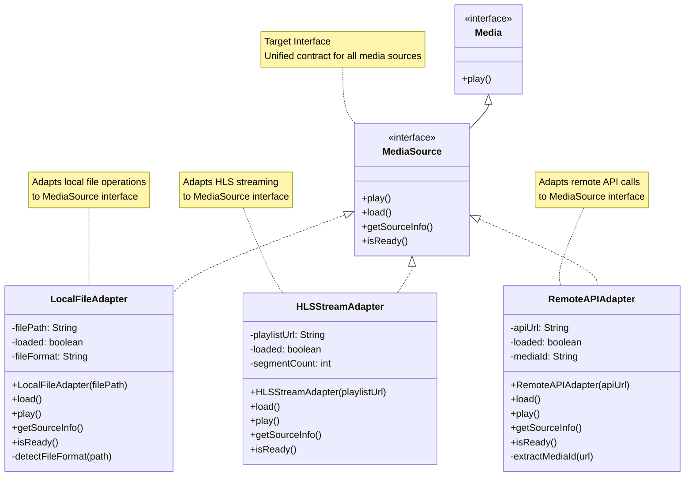
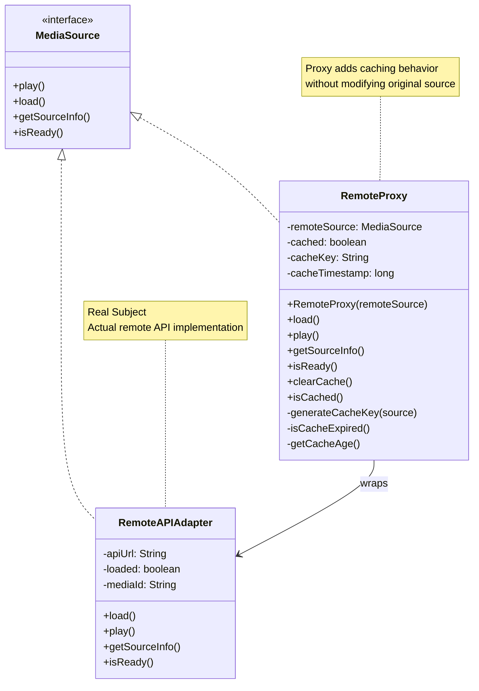
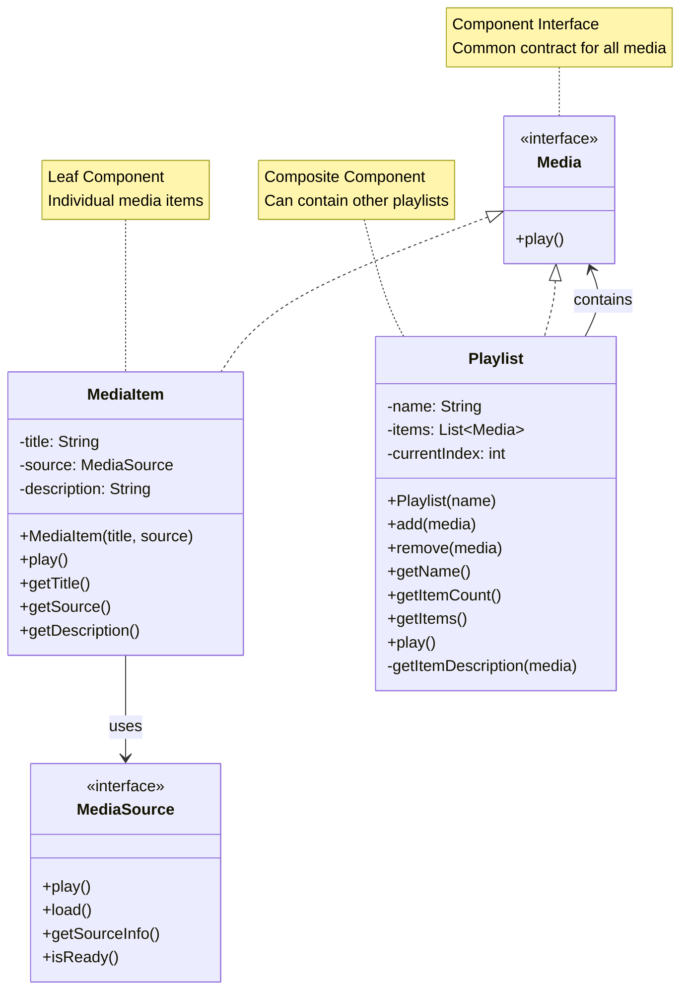
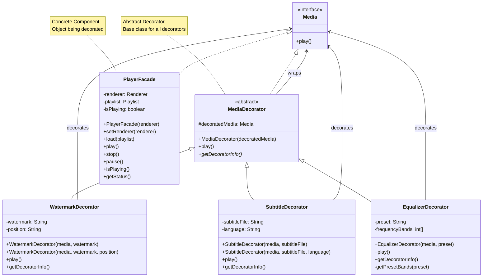
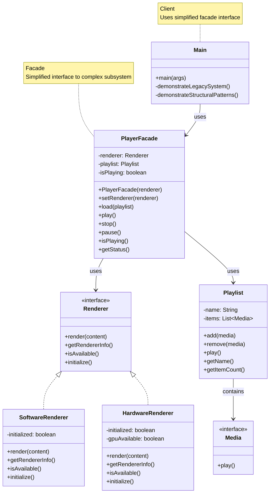
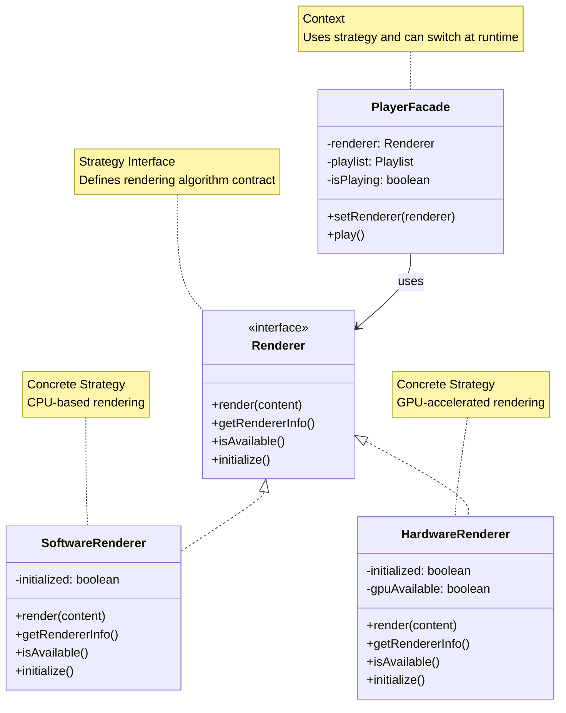
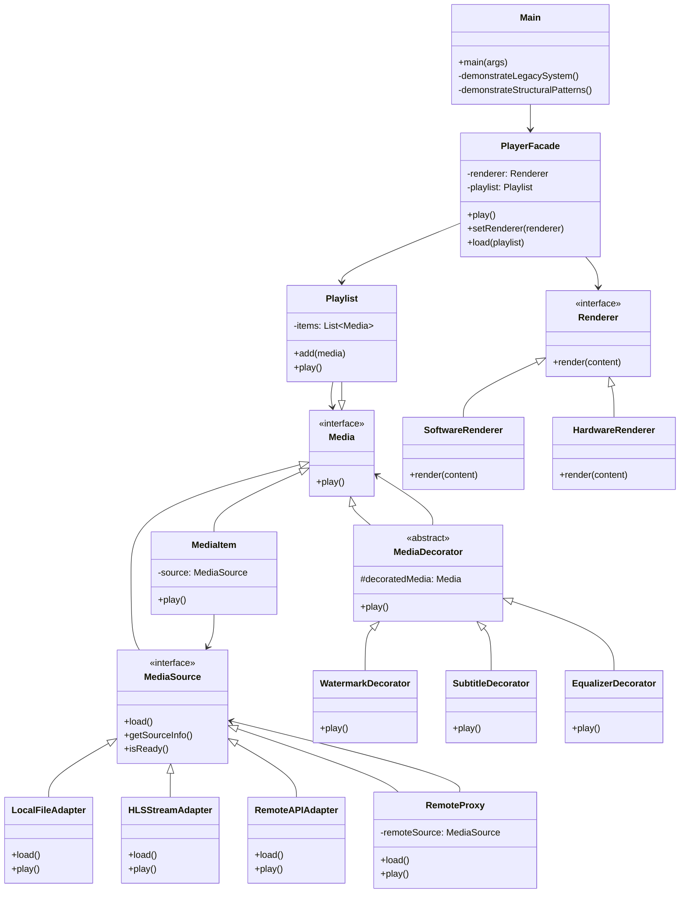

# Mermaid UML Diagrams for Structural Design Patterns

## 1. Adapter Pattern

## 2. Proxy Pattern

## 3. Composite Pattern

## 4. Decorator Pattern

## 5. Facade Pattern

## 6. Strategy Pattern

## 7. Complete System Architecture

## Usage Instructions

1. Copy any diagram code above
2. Paste into Mermaid Live Editor: https://mermaid.live/
3. Or use in documentation tools that support Mermaid
4. Each diagram shows the structure and relationships of one specific pattern
5. The final diagram shows how all patterns work together in the system
